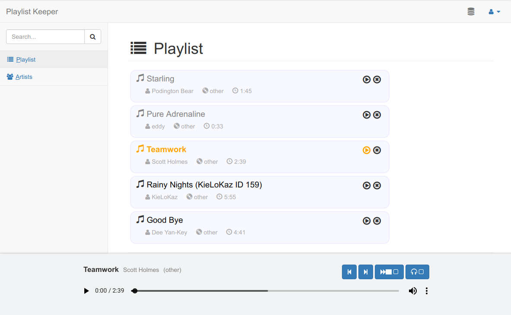

Playlist Keeper
===============

[](https://travis-ci.org/nymanjens/musik)

This project aims to an excellent music player for mobile and desktop.

## Features

* Synchronizes current play queue over all devices
* Remote control (e.g. pause mobile player via desktop)

## Screenshot



## Installation

- Clone this repository or download the files
- Run following commands to get the app running:

    ```
    # refresh application secret
    sbt playUpdateSecret

    # Build application
    sbt dist

    # Deploy files
    cd /somewhere/you/want/the/files
    unzip .../target/universal/musik-1.0-SNAPSHOT.zip
    mv musik-1.0-SNAPSHOT/* .
    rm -d musik-1.0-SNAPSHOT/

    # Create database tables
    bin/server -DdropAndCreateNewDb
    rm RUNNING_PID

    # Create admin user
    bin/server -DcreateAdminUser
    rm RUNNING_PID

    # Run application
    bin/server
    ```

## Configuration
- `conf/application.conf`:<br>
  Setup and configure a database here.
- Add users:<br>
  A default user is created with the `-DcreateAdminUser` flag (username: admin, password:
  changeme). This account can create new users.
